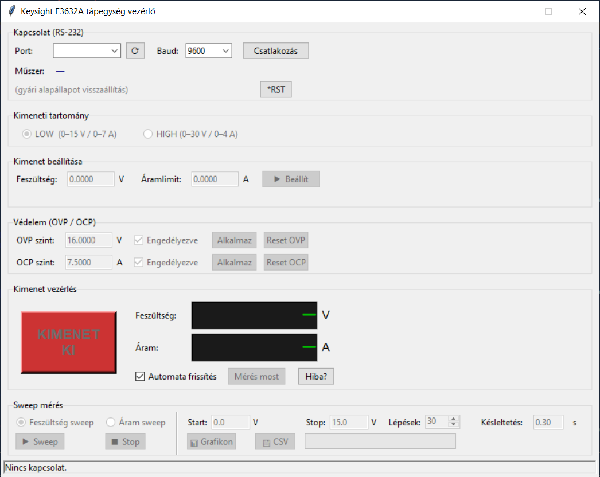

# PSU_E3632A – Keysight E3632A tápegység vezérlő



Keysight E3632A DC tápegység kézi vezérlő GUI-ja RS-232 soros porton. Valós idejű feszültség- és árammérést végez a 34465A DMM-mel, és matplotlib grafikonon jeleníti meg az eredményeket.

## Funkciók

- Feszültség és áramerősség beállítása
- Tartomány: LOW (0–15 V / 0–7 A) · HIGH (0–30 V / 0–4 A)
- Valós idejű mérési grafikon matplotlib TkAgg backenddel
- CSV naplózás
- OVP és OCP vezérlés

## Kapcsolódás

| Eszköz | Kapcsolat |
|--------|-----------|
| Keysight E3632A PSU | RS-232 null-modem kábel (9600 baud, 8N2, DTR/DSR) |
| Keysight 34465A DMM | TCP SCPI Sockets, port 5025 |

## Követelmények

```
pip install pyserial matplotlib
```

## Futtatás

```bat
python psu_e3632a.py
```

## Build (önálló exe)

```bat
build.bat
```

Kimenet: `dist\PSU_E3632A.exe`

## Forrás

Keysight E3632A User's Guide (9018-01309)
